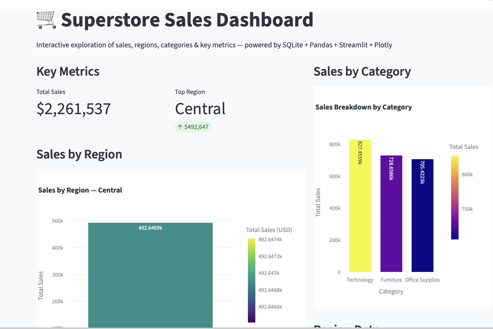

# Superstore Sales Dashboard

Interactive business dashboard built with **Python**, **Pandas**, **SQLite**, **Streamlit** and **Plotly Express**  
using the classic **Sample - Superstore** dataset (retail sales, profit, customers, regions, categories, etc.).


*Interactive Streamlit dashboard showing sales by region, category and KPIs*

## Project Goals

- Practice data loading, cleaning and transformation with **pandas**
- Run analytical SQL queries against a local SQLite database
- Build an interactive web dashboard quickly using **Streamlit**
- Create beautiful, responsive visualizations with **Plotly Express**
- Combine pandas/SQL + Streamlit to tell business stories (sales by region, category, etc.)

## Features

- Sales by Region – interactive bar chart with filter
- Key performance indicators (total sales, top region)
- Sales breakdown by Category
- Sidebar filter for regions
- Data loaded from SQLite (created from CSV via pandas)
- Clean, modern look with custom CSS and metric cards

## Technologies Used

- **Python** 3.10+
- **pandas** – data manipulation
- **sqlite3** – local database
- **Streamlit** – web app framework
- **Plotly Express** – interactive charts
- **Superstore dataset** (≈10k rows of retail orders)

## Project Structure
PandasSQL/
├── dashboard.py                # Main Streamlit application
├── superstore.db               # SQLite database (generated)
├── dataSet/
│   └── superstore_dataset.csv  # Original CSV file
└── README.md                   # This file


## How to Run the Dashboard

### 1. Prerequisites
```bash
# Recommended: create a virtual environment
python -m venv venv
source venv/bin/activate    # Mac/Linux
# venv\Scripts\activate     # Windows

pip install streamlit pandas plotly

### 2. Prepare the Data
# Run this in Jupyter / Python console once
import pandas as pd
import sqlite3

df = pd.read_csv("dataSet/superstore_dataset.csv", encoding="latin1")
conn = sqlite3.connect("superstore.db")
df.to_sql("orders", conn, if_exists="replace", index=False)
conn.close()

### 3. Launch the dashboard
streamlit run dashboard.py # Opens in http://localhost:8504

# Useful commands
# Run with specific port (if 8501 is busy)
streamlit run dashboard.py --server.port 8502

# Run in background (useful for sharing locally)
streamlit run dashboard.py --server.headless true